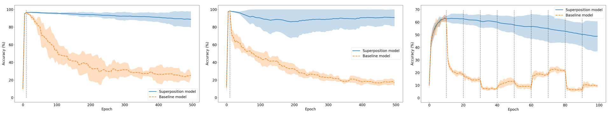

# Compressed Superposition of Neural Networks for Deep Learning in Edge Computing

This repository contains code written for all experiments mentioned in the article Compressed Superposition of Neural Networks for Deep Learning in Edge Computing.

### Article abstract  

This paper investigates a combination of the two recently proposed techniques: superposition of multiple neural networks into one and neural network compression. 
We show that these two techniques can be successfully combined to deliver a great potential for trimming down deep convolutional neural networks.
We study trade-offs between the model compression rate and the accuracy of the superimposed tasks and present a CNN pipeline where the fully connected layers are isolated from the convolutional layers and serve as a general purpose neural processing unit for several CNN models. 
The work has a significant importance in the context of implementing deep learning on low-end computing devices as it enables neural networks to fit edge devices with constrained computational resources (e.g. sensors, mobile devices, controllers).

### Start using this repository


*Figure 1: Superposition vs. baseline model for MNIST with NN (left), CNN (middle) and CIFAR with CNN (right)*

#### Install needed libraries and dependencies

To install all needed dependencies for this repository run the following command in the terminal: 

```console
$ pip install -r requirements.txt
```

#### Run superposition method

To try the superposition method run *superposition.py* file. You can choose dataset (*mnist* or *cifar*) and model type (*nn* or *cnn*) on lines 215, 216.


#### Run superposition with harmonization

To try superposition method with harmonization run *harmonization.py*.

